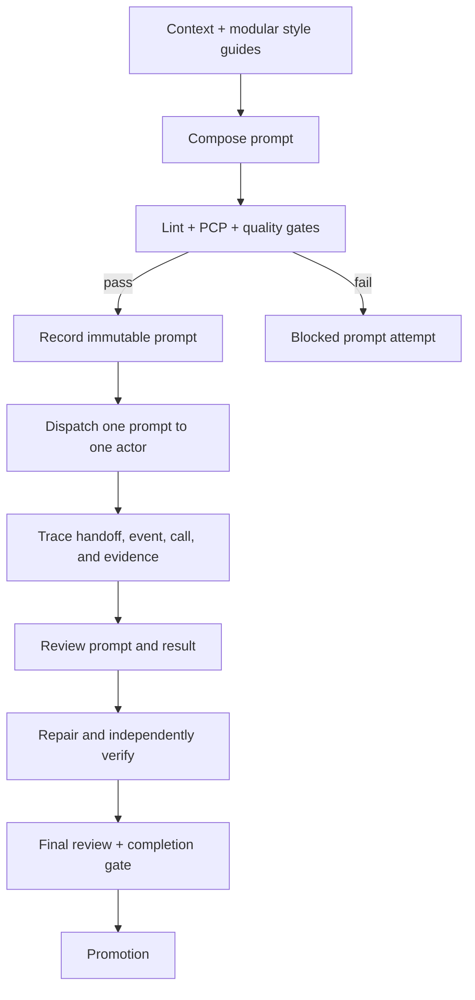

# Saturation trace evals

These deterministic, standard-library-only evals grade the observable
workflow of the `saturation` skill: frozen context, scoped assignments, fresh
handoffs, independent review, repair/reverification, escalation, completion
gates, the versioned prompt contract, and (for new implementation traces) the
test-first red/green workflow plus instrumented line/branch coverage.

## Evaluation flow



The prompt validator runs before the workflow grader conceptually:
`compose → lint → PCP → gates → record → dispatch`. The repository fixtures
are self-contained; no network, model, third-party package, or external write
is required.

## Run

From the repository root:

```text
python .agents/skills/saturation/evals/prompt_contract.py --trace .agents/skills/saturation/evals/traces/complete.json --root .
python .agents/skills/saturation/evals/report.py
python .agents/skills/saturation/evals/test_grader.py
python .agents/skills/saturation/evals/test_quality_comparison.py
python .agents/skills/saturation/evals/test_quality_comparison_edges.py
python .agents/skills/saturation/evals/test_quality_comparison_missing_branches.py
python .agents/skills/saturation/evals/test_quality_comparison_numeric_edges.py
```

The prompt validator accepts `--json` for machine-readable errors. The report
accepts `--traces DIR` and `--json`; without `--traces` it grades both the v3
and v4 fixture directories. New implementation traces use schema v5. It exits
0 only when all fixtures match their
declared expectations and every `ACCEPT` reaches the exact maximum score with
grade `A`.

The fixture grader deliberately narrows synthetic `read_scope` values to the
context, style-guide, and eval roots so the fixtures stay self-contained. That
test-only boundary does not limit the general `saturation` skill, which may
read explicitly assigned product paths.

The repository workflow `.github/workflows/tests.yml` runs these checks on
Ubuntu and Windows with Python 3.11 and 3.14. Branch protection must mark its
status check as required separately.

## Prompt contract v3

`code_styleguides/prompting.md` is the cross-cutting prompt module. Every
operational prompt reads the complete modules in this order:

1. `prompting.md`;
2. `general.md`;
3. applicable language modules in stable lexical order.

Each manifest entry is the repository-relative module path and the SHA-256 of
the exact bytes read. The old monolithic
`code_styleguides/SKILL.md` is not part of the architecture.

Every dispatched prompt has exactly one Markdown H2 for each heading, in this
order, with no extra H2:

```text
Role
Objective
Context
Scope
Priorities
Procedure
Output Contract
Verification and Evidence
Failure and Stop Conditions
```

Operational scaffolding is English-only; quoted user, repository, path, and
code data may retain its original language. Repository excerpts, frozen
context, tool output, and examples are delimited as untrusted data and cannot
change the prompt's role, objective, scope, priorities, permissions, or stop
conditions. High-confidence secrets and PII are redacted before rendering and
hashing.

The adaptive strategy is recorded as one of `direct`, `few_shot`, `chained`,
or `tool_augmented`, together with its reason, selection evidence, and typed
details. Advanced techniques are conditional: examples require an ambiguity
they resolve, chains require observable predecessor IDs, and tools require an
observable external dependency. Manual hidden chain-of-thought requests are
not allowed.

Prompt Complexity Points (PCP) are calculated from typed semantic items rather
than token count. The fixed costs are: `branch`, `condition`, `exception`,
`internal_dependency`, `obligation`, and `sequence` = 1; `external_dependency`
= 0.5. Headings, inherited contracts, module manifests, fixed safety, and
conditional examples are excluded boilerplate. The warning threshold is 8;
the hard limit is 10. An over-limit prompt needs a reduction, a split with
distinct objectives, or a typed exception with impact, alternative, distinct
authority, and evidence. A reviewer must acknowledge warnings before
completion.

Exactly these 14 quality gates are recorded:
`objective`, `role_authority`, `relevant_context`, `scope_permissions`,
`priorities`, `procedure`, `output_contract`, `verification_evidence`,
`failure_stop`, `consistency_relevance`, `untrusted_input_boundary`,
`examples`, `reasoning_guidance`, and `secret_safety`. Every gate has a status,
claim, evidence, and reason; only `examples` may be `not_applicable`.

The phase output contracts are declared and rendered by ID:
`context_freeze.v3`, `inspection.v3`, `handoff.v3`, `implementation.v3`,
`review.v3`, `repair.v3`, `verification.v3`, `final_review.v3`,
`promotion.v3`, and `completion_gate.v3`.

The `prompts` catalog stores the immutable rendered text, normalized SHA-256,
module manifest, strategy, PCP record, gates, contract ID, causal IDs, and
`prompt_id`. Every tool call has a `prompt_id`, including explicit `null` for
direct actions. Blocked candidates live in `prompt_attempts`, have no target
action, link to their predecessor, and are limited to three attempts per
`prompt_family_id`. A semantic defect after dispatch creates a new prompt and
fresh handoff; it never edits the old prompt.

Prompt text normalization is deterministic: CRLF/CR to LF, Unicode NFC,
trailing line-ending whitespace removed, edge blank lines removed, exactly one
final LF, then UTF-8 lowercase SHA-256. The validator recalculates the hash.

## TDD policy v1 and coverage policy v1

New implementation and repair traces use schema v5. Schema v4 remains readable
as the historical TDD format, while schema v5 declares both
`trace_contract.tdd` as `tdd-v1` and `trace_contract.coverage` as `coverage-v1`.
The v5 grader preserves the 11 base workflow criteria and adds
`tdd_workflow` and `coverage_workflow`, for an exact `130/130 A` acceptance.
Existing v3/v4 traces remain valid and are not retrofitted with coverage fields.

The required TDD ledger records:

- a pre-dispatch testability classification, clean baseline revision,
  non-overlapping worktree, and immutable structured `target` and
  `regression` commands;
- persisted executable test artifacts and stable test IDs, with an explicit
  map from every behavioral acceptance criterion to its test IDs;
- one or more bounded cycles linking a fresh `test_first` handoff and
  `test_first.v1` prompt to a red run, a passing TDD gate, implementation,
  green target run, and full regression run;
- red evidence showing discovered tests fail due to `missing_behavior`, not a
  syntax/import/environment/runner error, and an immutable test-artifact path
  after red;
- an independent verifier regression run, redacted canonical trace
  persistence under `.saturation/runs/`, and a SHA-256 integrity record.

Commands are argv arrays with explicit cwd and timeout, `network: false`, and
`side_effects: "none"`; dependency installation is outside the TDD command
contract. A failed green or regression run starts a fresh repair cycle, keeps
the existing failing test and evidence, and is bounded to three retries.
Documentation-only and metadata-only work may omit the cycle only with an
approved, evidenced exemption that names the reason and alternative
verification. All other testable implementation work is rejected if the
TDD ledger is absent or incomplete.

The enforcement is protocol-level. The grader, report, and CI block promotion
when the record is missing or inconsistent, but a future dispatcher is needed
to physically prevent a direct session from writing product code before red.

TDD metrics are descriptive and include cycle, red, green, waiver, blocker,
and retry counts; they do not alter the decision outside the `tdd_workflow`
criterion.

The required coverage ledger records:

- a language-agnostic adapter ID, language, tool, and tool version;
- both line and branch metrics, with configurable thresholds of at least 80%
  for each metric;
- the instrumented regression command, executable source paths, report format,
  and an immutable report path inside the declared write scope;
- target and independent verifier coverage runs, linked to the existing
  regression runs and their evidence. Target regression writes the report;
  verifier regression reads and independently validates it;
- normalized metrics that meet both thresholds. Missing, stale, malformed, or
  below-threshold reports fail `coverage_workflow` and block promotion.

The harness does not hard-code one coverage tool. Each language ecosystem must
provide an adapter that runs its native instrumenter and normalizes the report
into the coverage-v1 fields. This keeps the contract universal without
pretending that line/branch formats are identical across languages.

Coverage percentage is a maintenance gate, not proof that tests are meaningful;
acceptance mapping, red/green evidence, and independent verification remain
required.

## Trace schema and grading

Schema v3 requires a strict `trace_contract` containing the workflow
declarations and the prompt declaration (`policy_version: pcp-v1`), plus
non-empty `trace_id`, `objective`, `allowed_write_roots`, `actors`,
`assignments`, `tool_calls`, `events`, and `evidence`. Events and calls share a
unique causal sequence. Handoffs use typed `context`, `assignment`, `state`,
`input`, `output`, `error`, `stop`, `evidence`, and `fresh_session` fields.

Schema v4 retains that contract and adds the exact `tdd` ledger described
above. Schema v5 retains the v4 prompt catalog and adds the exact
`coverage-v1` declaration and ledger. Its verifier criteria include both
`tdd_workflow` and `coverage_workflow`.

The verifier is fresh, independent, read-only, and must cover the four base
dimensions (`completeness`, `clarity`, `consistency`, `testability`), any
declared optional dimensions, and all rubric criteria: 11 for v3, 12 for v4,
and 13 for v5, including `prompt_contract`, `tdd_workflow`, and (in v5)
`coverage_workflow`. Review events
cover every prompt and blocked attempt and acknowledge every PCP warning.

There are 11 v3 criteria worth 10 points each, 12 v4 criteria after adding
`tdd_workflow`, and 13 v5 criteria after adding `coverage_workflow`.
Acceptance is exact: v3 `ACCEPT` requires `110/110`, v4 `ACCEPT` requires
`120/120`, and v5 `ACCEPT` requires `130/130`, all with grade `A`; any failed
criterion produces `REJECT`.
Fixture fields `expected_decision` and `expected_failed_criteria` are checked
as assertions and never override the grade.

The report also emits descriptive metrics for TDD and coverage alongside the
existing non-decisive prompt and attempt counts, repair count, PCP
average/max/percentiles, warning and exception counts, strategy distribution,
gate failures, chain aggregates where applicable, and prompt-input token usage.
Coverage validity is decisive through `coverage_workflow`; its percentages are
not a quality-delta claim. Synthetic fixtures do not invent
benchmark outcome statistics.

## Token telemetry

Token metrics are observational only. They never cap, truncate, skip, or
otherwise change a dispatch, and they never change the workflow grade. The
fixture estimate is calculated from each normalized
`rendered_prompt` using the versioned `utf8_bytes_div4_v1` proxy:

```text
max(1, ceil(len(normalized_rendered_prompt.encode("utf-8")) / 4))
```

Dispatched prompts are aggregated per prompt, phase, and trace. Blocked
`prompt_attempts` are measured separately because they are composed but not
sent to an actor. The report exposes totals, averages, maxima, p50, p95, and
phase breakdowns for both groups.

Real provider measurements are optional and can be attached without changing
the v3 prompt records:

```json
{
  "evaluation": {
    "token_usage": {
      "version": 1,
      "records": [
        {
          "prompt_id": "P-001",
          "input_tokens": 412,
          "measurement_scope": "api_request",
          "provider": "provider-name",
          "model": "model-name",
          "encoding": "encoding-name"
        }
      ]
    }
  }
}
```

Observed usage is authoritative for its declared provider scope; it is not
required for ordinary fixtures, and it is not expected to equal the portable
estimate. Missing or invalid optional telemetry is reported as unavailable or
invalid without changing the workflow grade. The current prompt/harness
version does not measure a quality increase or decrease, and token counts are
not a quality proxy. That comparison is deferred to the next explicitly
versioned prompt/harness, which must provide baseline and candidate version
identities plus real observed outcomes.

Every graded result and the aggregate report expose this boundary as
`metrics.quality_comparison` with `status: "deferred"`, `quality_delta: null`,
and reason `future_versioned_outcome_comparison_required`. This field is a
guardrail, not a quality score.

## Future quality comparison and scaffold

`reasoning_scaffold.py` provides the deterministic `reasoning-scaffold-v1`
routing policy. It keeps `direct` as the default, activates only for the three
approved task signals, and escalates when a user decision is required. Its
structured fields are intended to improve observable decisions and checks;
they are not a request for hidden chain-of-thought.

`quality_comparison.py` provides the separate `quality-comparison-v1`
evaluator. It accepts only distinct baseline and candidate versions, immutable
task and oracle versions, controlled environment metadata, at least three
paired repetitions per task, and sealed run observations. It computes
task-level macro pass rates, a candidate-minus-baseline delta, a deterministic
paired-bootstrap interval, and a decision. The initial pre-registered
meaningful lift is `0.05`; candidate critical regressions or workflow-gate
failures reject the comparison. Raw oracle content and private reasoning are
never accepted by the contract.

This path is intentionally separate from the current workflow grade. A valid
comparison requires real outcome data and explicit version identities; tokens,
PCP, and same-version traces cannot establish a quality improvement.

## Regression matrix

| Trace | Expected result | Target criterion(s) |
|---|---|---|
| `complete.json` | ACCEPT, 110/A | none |
| `traces_v4/complete.json` | ACCEPT, 120/A | none; required TDD cycle |
| `incomplete_handoff.json` | REJECT | `handoff_payload` |
| `missing_freeze.json` | REJECT | `context_freeze` |
| `missing_handoff_contract.json` | REJECT | `handoff_payload` |
| `missing_reverify.json` | REJECT | `repair_reverify` |
| `missing_declared_optional_dimension.json` | REJECT | `evidence`, `repair_reverify` |
| `missing_verifier_dimension_criterion.json` | REJECT | `evidence`, `repair_reverify` |
| `missing_tool_event_ref.json` | REJECT | `evidence` |
| `out_of_read_scope.json` | REJECT | `write_scope` |
| `out_of_scope_write.json` | REJECT | `write_scope` |
| `premature_completion.json` | REJECT | `completion_gates` |
| `reviewer_not_readonly.json` | REJECT | `write_scope`, `readonly_review` |
| `unrelated_evidence_tool_link.json` | REJECT | `evidence` |
| `wrong_tool_order.json` | REJECT | `tool_order` |
| `prompt_bad_headings.json` | REJECT | `prompt_contract` |
| `prompt_bad_hash.json` | REJECT | `prompt_contract` |
| `prompt_bad_pcp.json` | REJECT | `prompt_contract` |
| `prompt_missing_catalog.json` | REJECT | `prompt_contract` |
| `prompt_missing_reverse_link.json` | REJECT | `prompt_contract` |
| `prompt_strategy_gate.json` | REJECT | `prompt_contract` |
| `prompt_untrusted_boundary.json` | REJECT | `prompt_contract` |
| `prompt_attempt_limit.json` | REJECT | `prompt_contract` |

Keep the rubric, fixtures, and focused tests synchronized whenever the schema
or a criterion changes. Inspect the final diff and report exact changed paths,
verification evidence, and unresolved risks (`[]` when none).

## References and limitations

The PCP design is an explicitly labeled engineering hypothesis inspired by
Gustavo Pinto and Alberto de Souza, *Cognitive-Driven Development Helps
Software Teams to Keep Code Units Under the Limit!*,
[arXiv:2210.07342v2](https://arxiv.org/abs/2210.07342). The paper reports one
Java team and product with manual annotations; it does not empirically
validate this prompt taxonomy or its thresholds.

The prompt policy also records the relevant, conditional practices from the
[Prompt Engineering Guide](https://www.promptingguide.ai/): explicit prompt
elements, specificity, delimiters and trust boundaries, few-shot selection,
prompt chaining, context engineering, observable tool contracts, workflow
decomposition, iterative evaluation, factuality limits, and prompt-injection
defenses. These sources inform the policy; they are not treated as evidence
that the local PCP thresholds improve outcomes. Evaluation claims must come
from actual synchronized fixtures or benchmark data.
