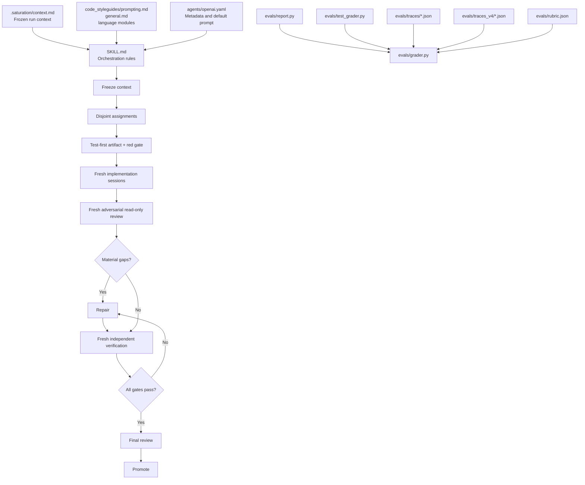

# Saturation

Saturation is a Codex skill for orchestrating implementation work through fresh, scoped subagents. It turns the current session context into a frozen execution contract and guides the work through implementation, independent review, repair, verification, and promotion.

## What it provides

- A repeatable workflow for complex implementation tasks.
- Explicit scopes, assignments, handoffs, and evidence.
- Fresh sessions for implementation, review, and verification.
- Adversarial, read-only review before promotion.
- A deterministic evaluation suite for catching workflow regressions.
- A canonical prompt policy with modular composition, PCP complexity budgets,
  quality gates, and traceable prompt evidence.
- Enforced test-first execution for testable implementation and repair
  assignments, with persisted executable test artifacts and red/green gates.

## Workflow

1. Read the modular prompt and code-style guides, then freeze the active
   context in `.saturation/context.md` before delegation.
2. Split the work into disjoint assignments with explicit read and write scopes.
3. Compose, lint, and record each operational prompt before dispatch.
4. For testable implementation work, create and run the executable test
   artifact first; require a genuine red result before implementation.
5. Implement the assignments in fresh sessions and return structured handoffs.
6. Review the result and its prompts with a fresh, adversarial, read-only reviewer.
7. Repair every material gap and verify the repair independently.
8. Promote the result only after the final review and all completion gates pass.

Scope changes, conflicts, real-world effects, and unresolved blockers must be escalated instead of being silently absorbed.

Assignments may read and write explicitly scoped product paths; the synthetic
trace fixtures use a narrower, self-contained read boundary only for testing.

## At a glance

The frozen context and style guide feed the orchestration rules. Work then moves through fresh implementation, review, repair, verification, and promotion sessions. The evaluation suite grades the observable trace of that workflow.



## Repository layout

```text
.agents/skills/saturation/
├── SKILL.md                    # Core skill instructions
├── agents/openai.yaml          # Display metadata and default prompt
├── code_styleguides/
│   ├── README.md               # Module index and selection order
│   ├── prompting.md            # Prompt construction and prompt trace policy
│   ├── general.md              # Cross-language structural design
│   └── <language>.md           # Language-specific guidance
└── evals/
    ├── prompt_contract.py      # Prompt contract and PCP validator
    ├── grader.py               # Trace schema and behavioral grader
    ├── tdd_contract.py         # Schema v4 test-first/red-green contract
    ├── token_metrics.py        # Descriptive prompt-input token metrics
    ├── report.py               # Portable command-line entry point
    ├── rubric.json             # Grading criteria and fixture matrix
    ├── test_grader.py          # Focused unit tests
    ├── traces/                 # v3 valid and regression trace fixtures
    └── traces_v4/              # v4 TDD trace fixtures
.saturation/context.md          # Frozen orchestration context for a run
```

## Use the skill

In a Codex session, invoke the skill with:

```text
/saturation
```

The skill reads the current session context, freezes it in `.saturation/context.md`, and uses that file as the source of truth for the delegated work.

## Run the evaluation suite

The evaluation suite uses only the Python standard library. From the repository root, run:

```text
python .agents/skills/saturation/evals/prompt_contract.py --trace .agents/skills/saturation/evals/traces/complete.json --root .
python .agents/skills/saturation/evals/report.py
python .agents/skills/saturation/evals/test_grader.py
```

The report grades the checked-in synthetic v3 and v4 traces by default and
exits successfully only when every declared expectation matches and each
`ACCEPT` reaches its schema's maximum score (`110/110` for v3, `120/120` for
v4). Use `--json` for machine-readable output or `--traces DIR` to grade
another directory of direct JSON trace files. Prompt-aware traces include
rendered prompt evidence, strict module manifests, PCP, and quality gates;
v4 also includes the `tdd-v1` test-first ledger. The prompt validator can
independently verify the canonical prompt contract and module hashes; the
report also emits descriptive PCP, strategy, gate, attempt, repair, TDD, and
prompt-input token metrics that do not alter acceptance. Fixture token estimates
use the versioned
`utf8_bytes_div4_v1` proxy; optional provider observations are recorded under
`evaluation.token_usage` and are model/tokenizer scoped. The current version
does not measure quality increases or decreases; that requires a future
versioned prompt/harness comparison with baseline and candidate outcomes.
Reports expose this boundary as `metrics.quality_comparison.status=deferred`
with no quality delta.

The checked-in GitHub Actions workflow (`.github/workflows/tests.yml`) runs
the v3/v4 validators, aggregate report, and focused tests on Ubuntu and
Windows with Python 3.11 and 3.14. Configure the workflow's status check as a
required branch-protection check in the repository settings.

## Contributing

- Keep the evaluator deterministic and dependency-free.
- Preserve the lifecycle gates: freeze, implement, review, repair, verify, and promote.
- Keep reviewers and verifiers fresh and read-only.
- Update the rubric, fixtures, and focused tests together when changing the trace contract.
- Keep schema v3 fixtures readable and use schema v4 for new testable
  implementation runs.
- Require a persisted executable test artifact and a recorded red → green
  cycle for every non-exempt implementation or repair assignment.
- Keep token metrics descriptive; they must not cap, truncate, or block model dispatch.
- Defer quality-delta measurement until the next explicitly versioned
  prompt/harness comparison; never use token counts as a quality proxy.
- Run the prompt validator for v3 and v4, the report, and the focused tests
  before submitting a change.
- Do not mutate `.saturation/context.md` after it has been frozen for a run.
